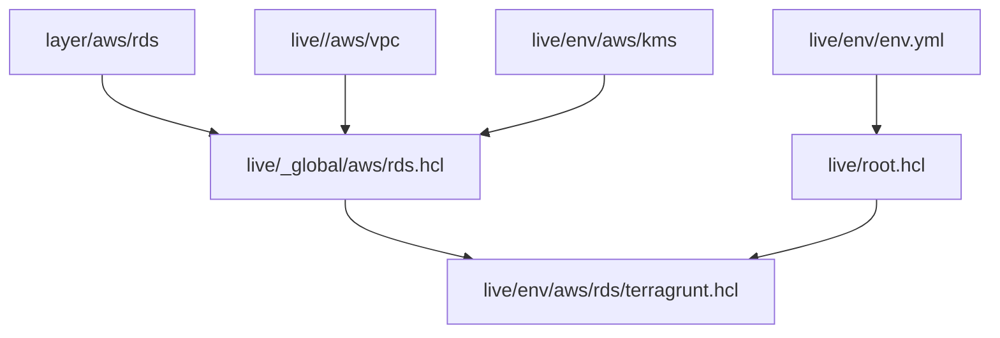

# Spelling Bee script

A simple python script to help in solving any Spelling Bee.
A list a words needs to be added in the `words.txt` file and the `config.yml` needs to receive the **required letter** and **optional letters**.

Once the script is executed it will generate the `result.txt` file with the result of the filter.


## Requirements

```bash
pip3 install pyyaml
```

## Configuration

Change the `config.yml` file as following:

``` yaml
settings:
  letters:
    required: <REQUIRED LETTER>
    optional:
    - <OPTIONAL LETTER>
    ...
  files:
    word: <PATH/WORDS FILENAME>.txt
    result: <PATH/RESULT FILENAME>.txt
```

## Usage

```bash
python3 filter.py
```

